# pvt-dimensioner

Prime Vision Technology code to collect weight and dimension data from the robotic sorting by using a VMS (Volume Measurement System) from SICK.

## Description

A Volume Measurement Systems consist of the following:
* LMS400: 2D lidar sensor
* Lector850: Barcode Reader
* SIM2x00-2-prime: Sensor Integrated Machine
* Photo-Eye
* Prime Vision robotic sorting system

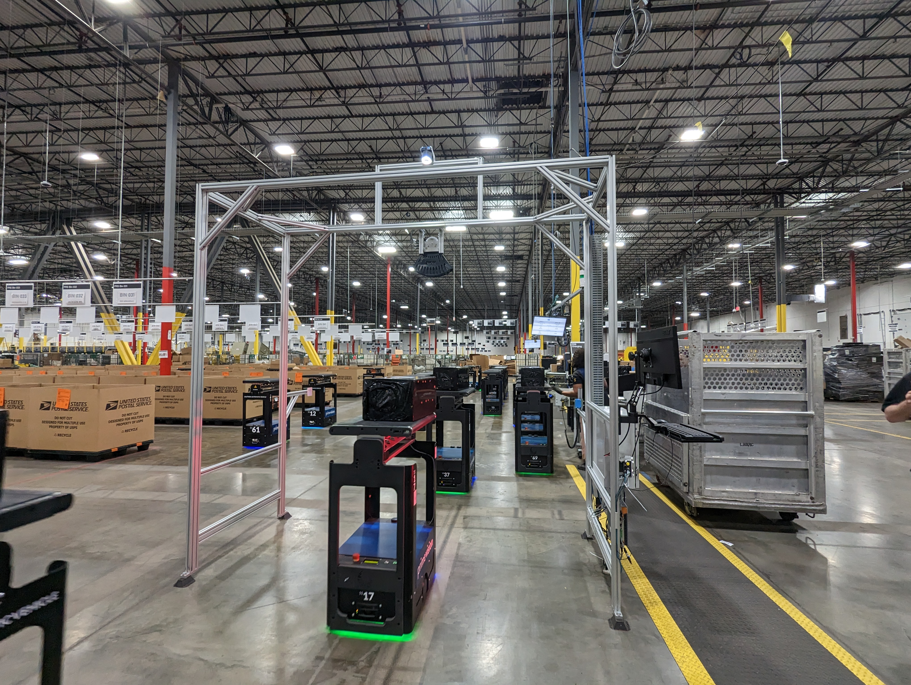

The PVT-dimensioner-client does many things asynchronously and is designed for collecting data and outputting results in real-time:
* TCP client/server interface with SIM2x00 device

Multiple clients and servers can subscribe to eachother using different decoding protocols (JSON, XML, Binary)
* FTP client for bundling JPEG and pointcloud data in FTP folder for every piece 

The FTP client can subscribe to different users and asynchronously monitors the home folder of every user for new files. It then bundles the files in a folder and uploads it to the FTP server.

* Websocket clients

The websocket clients can subscribe to different front-end messages and are a great way for a non-physics and headless simulation of the robotics sorting system.

* Mongodb client

Can subscribe to a database and monitors if new data is available. Upon detection of a new data entry a user defined callback function can be called.

* TJESS server/client for interacting with Prime Vision Frontend applications

TJESS is Prime Vision IPC protocol for communicating between different applications. It is a python wrapper around ZeroMQ. The PVT-dimensioner-client can subscribe to different TJESS messages and can also send TJESS messages to other applications.

* HTTP server endpoints showing the past 12 hours of data collection
* Reporting service for generating PDF reports every 24 hours

## Getting started

Simple steps to get you started with the dimensioner client,

***Production***

The PVT-dimensioner-client can be downloaded as a debian and installed via Prime Vision's appcenter. An example config and environment file are provided in this repository. 

***Simulation***

There is a one liner for starting all the simulation software in the scripts folder. Make sure to install the correct binaries
```
cd scripts/
./starter.sh
```

***Building***

This project uses a combination of pyinstaller and cmake to bundle all the python code into one executable and debian file. You can build this locally on your computer by using the docker file. The build environment is still in development, so reach out to one of the maintainers if you run into any issues.

## Usage

The following HTTP endpoints are available:
* dumplectordata: shows the time, barcodes, ftp folders 
* dumppayload: shows the time, barcode, robot, destination
* dumpweights: shows the time, barcode, robot, destination, weight
* dumpvolumes: shows the time, boxvolume, lxwxh, measurement status
* dumpvolumetric: shows all the available data from pieces that the client was able to match between the dimensioner system and the FRS system. The most common reason why pieces are not shown here is because the barcodes can not be read.

The reporting service creates the following plots:
* Throughput data, Scanner Performance and reject analysis

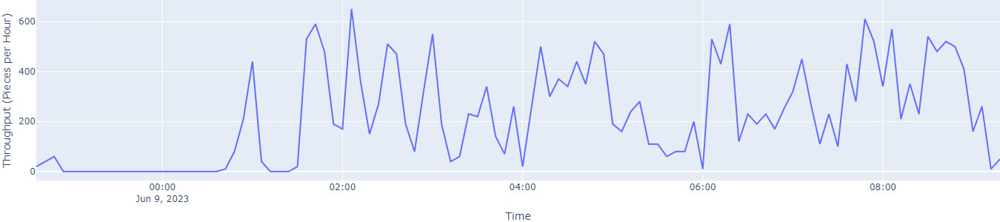
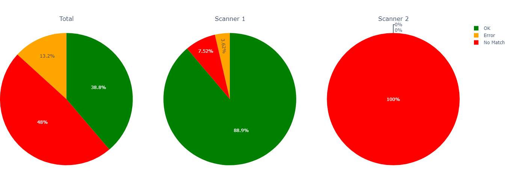
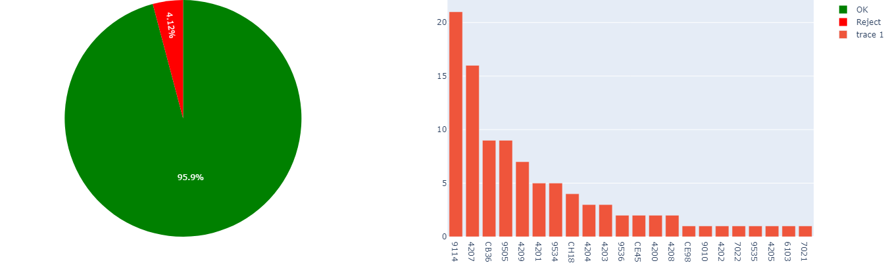

* Weight distribution, weight per direction, 5 heaviest pieces, 5 lightest pieces

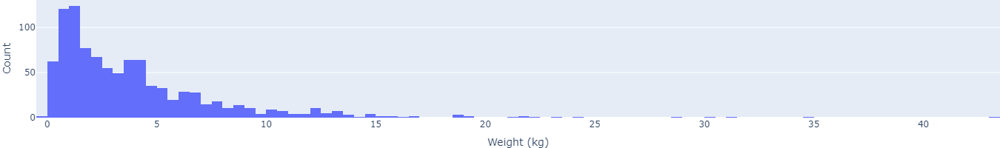
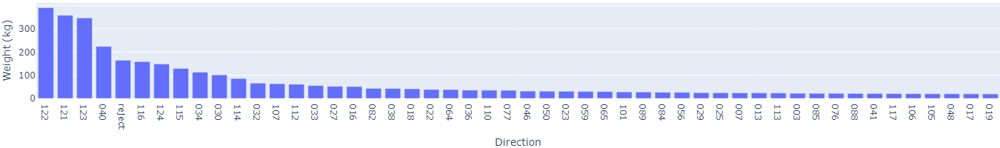
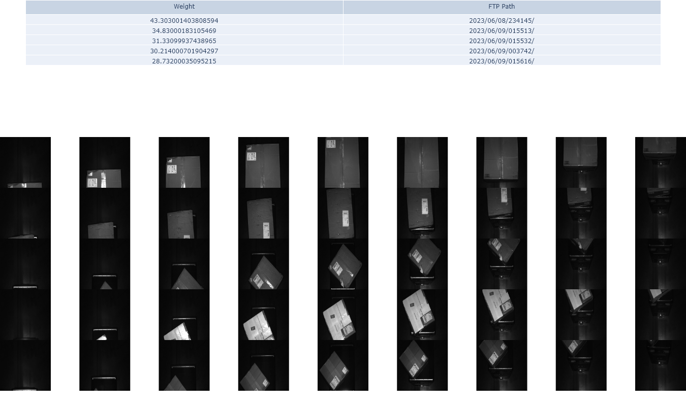
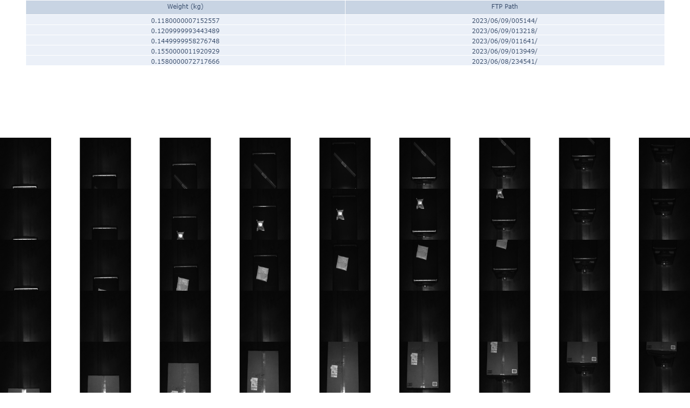

* Volume distribution

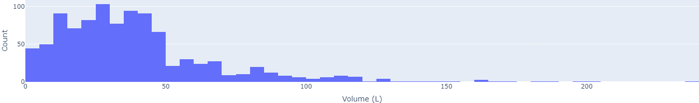
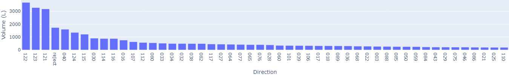
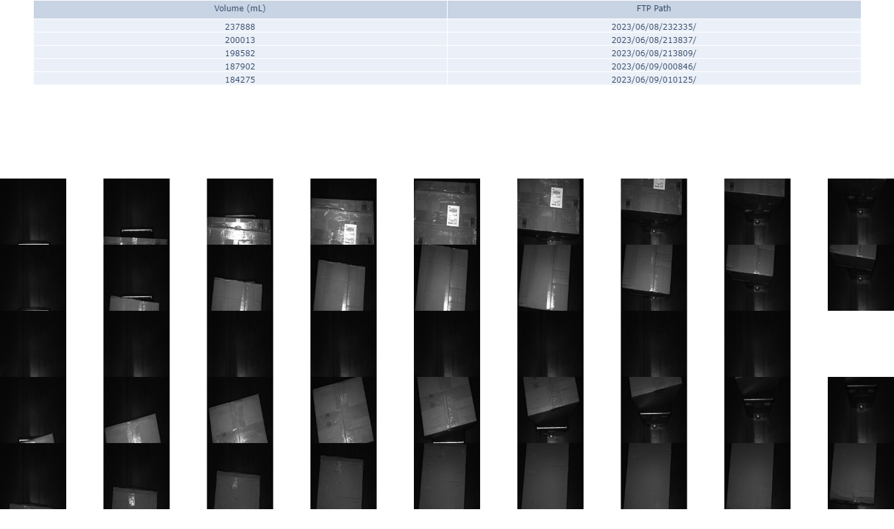
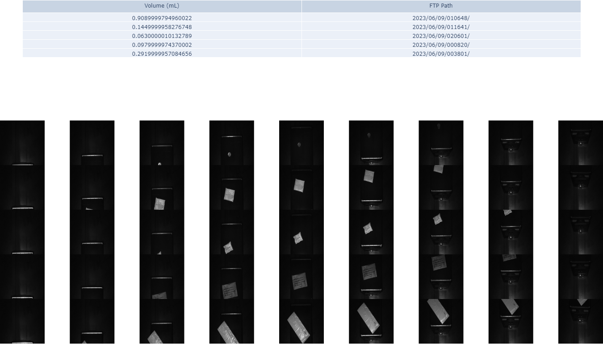


## Roadmap

Some next steps in this project that the team is working on:
* Improve the read rate of the dimensioning system
* Payload information from customer should include expected Volume data
* Reroute robots based on VMS data
* Improving bin-full detection algorithm
* Improving package analytics 
* Point cloud data for better robotic arm control and piece picking

## Support

IST team from Prime Vision Technology is actively supporting this project.

## Contributing

Adjustments can be made in the simulation. Create your own branch and do a merge request with the author as reviewer.

**Environment Variables**

Contributors need the credentials for Prime Vision's FTP server. Please reach out to the author about these credentials.

## Authors
Timo Thans: t.thans@primevision.com